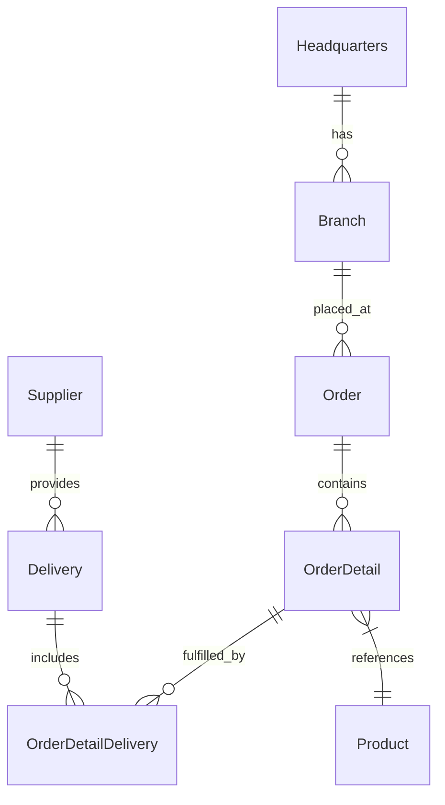

# 🚀 OctoCAT Supply Chain: The Ultimate GitHub Copilot Demo


Welcome to the OctoCAT Supply Chain Management System - your go-to demo for showcasing the incredible capabilities of GitHub Copilot, GHAS, and the power of AI-assisted development!

## ✨ What Makes This Demo Special

This isn't just another demo app - it's a carefully crafted showcase that demonstrates the full spectrum of GitHub's AI capabilities:

- 🤖 **Copilot Agent Mode & Vision** - Watch Copilot understand UI designs and implement complex features across multiple files
- 🎭 **MCP Server Integration** - Demonstrate extended capabilities with Playwright for testing and GitHub API integration
- 🛡️ **Security First** - Showcase GHAS scanning and Copilot-powered vulnerability fixes
- 🧪 **Test Generation** - Exhibit Copilot's ability to analyze coverage and generate meaningful tests
- 🔄 **CI/CD & IaC** - Generate deployment workflows and infrastructure code with natural language
- 🎯 **Custom Instructions** - Show how Copilot can be tailored to understand internal frameworks and standards

## 🏗️ Architecture

The application is built using modern TypeScript with a clean separation of concerns:



### Tech Stack
- **Frontend**: React 18+, TypeScript, Tailwind CSS, Vite
- **Backend**: Express.js, TypeScript, OpenAPI/Swagger
- **DevOps**: Docker

## 🛒 Featured: Shopping Cart Implementation

This demo showcases a **complete shopping cart feature** built entirely with GitHub Copilot:

### ✨ What's Included
- **🛍️ Full Cart Functionality** - Add, remove, update quantities with real-time calculations
- **📱 Responsive UI** - Cart icon with live badge showing item count
- **💾 Persistent Storage** - Cart contents saved across browser sessions
- **🧮 Smart Calculations** - Automatic subtotals, discounts (5%), shipping, and grand totals
- **🎨 Modern Design** - Clean, intuitive interface with Tailwind CSS
- **⚡ Real-time Updates** - Instant UI feedback without page refreshes

### �️ Technical Implementation
- **TypeScript/React** - Type-safe component architecture
- **Context API** - Centralized state management with `CartContext`
- **localStorage** - Browser-based persistence with `cartStorage` utilities
- **Custom Hooks** - Reusable cart operations and state management
- **BDD Testing** - Comprehensive feature files for automated testing

### 📁 File Structure
```
frontend/src/
├── components/
│   ├── Cart.tsx                 # Main cart page component
│   └── Navigation.tsx           # Cart icon with badge
├── context/
│   └── CartContext.tsx          # Cart state management
├── types/
│   └── cart.ts                  # TypeScript interfaces
└── utils/
    └── cartStorage.ts           # Storage utilities

features/
├── cart-management.feature      # CRUD operations testing
├── cart-icon-badge.feature      # UI display testing
├── cart-persistence.feature     # Storage testing
└── cart-calculations.feature    # Math validation testing
```

## �🎯 Key Demo Scenarios

1. **Vibe Coding with Cart Implementation** ⭐
   - Implement shopping cart from design mockup using Copilot Agent Mode
   - Watch Copilot analyze UI requirements and generate TypeScript components
   - Demonstrate multi-file implementation with state management
   - Show real-time UI updates and localStorage persistence

2. **BDD Testing Generation** ⭐
   - Generate comprehensive BDD feature files from natural language
   - Create Playwright automation tests for cart functionality
   - Execute end-to-end testing scenarios with live validation
   - Showcase test-driven development with Copilot

3. **Security and Best Practices**
   - Scan for vulnerabilities using GHAS
   - Generate automated fixes
   - Implement security best practices with Copilot guidance

4. **DevOps Automation**
   - Generate GitHub Actions workflows
   - Create infrastructure as code
   - Set up container deployments

## 🚀 Getting Started

1. Clone this repository
2. Build the projects:
   ```bash
   # Build API and Frontend
   npm install && npm run build
   ```
3. Start the application:
   ```bash
   npm run dev
   ```
4. Explore the shopping cart feature:
   - Navigate to [Products page](http://localhost:5137/products) to add items
   - View your cart at [Cart page](http://localhost:5137/cart)
   - Notice the cart icon badge in the navigation

Or use the VS Code tasks:
- `Cmd/Ctrl + Shift + P` -> `Run Task` -> `Build All`
- Use the Debug panel to run `Start API & Frontend`

### 🧪 Testing the Cart Feature
Run the BDD tests with Playwright:
```bash
# The cart feature includes comprehensive BDD test scenarios
# Test files are located in the /features directory
# - cart-management.feature
# - cart-icon-badge.feature  
# - cart-persistence.feature
# - cart-calculations.feature
```

## 🛠️ MCP Server Setup (Optional)

To showcase extended capabilities:

1. Install Docker/Podman for the GitHub MCP server
2. Use VS Code command palette:
   - `MCP: List servers` -> `playwright` -> `Start server`
   - `MCP: List servers` -> `github` -> `Start server`
3. Configure with a GitHub PAT (required for GitHub MCP server)

## 📚 Documentation

- [Detailed Architecture](./docs/architecture.md)
- [Complete Demo Script](./docs/demo-script.md)

## 🎓 Pro Tips for Solution Engineers

- Practice the demos before customer presentations
- Remember Copilot is non-deterministic - be ready to adapt
- Mix and match demo scenarios based on your audience
- Keep your GitHub PAT handy for MCP demos

---

*This entire project, including the hero image, was created using GitHub Copilot! Even this README was generated by Copilot using the project documentation.* 🤖✨